当你不需要一个虚拟机的时候，直接删除文件即可。

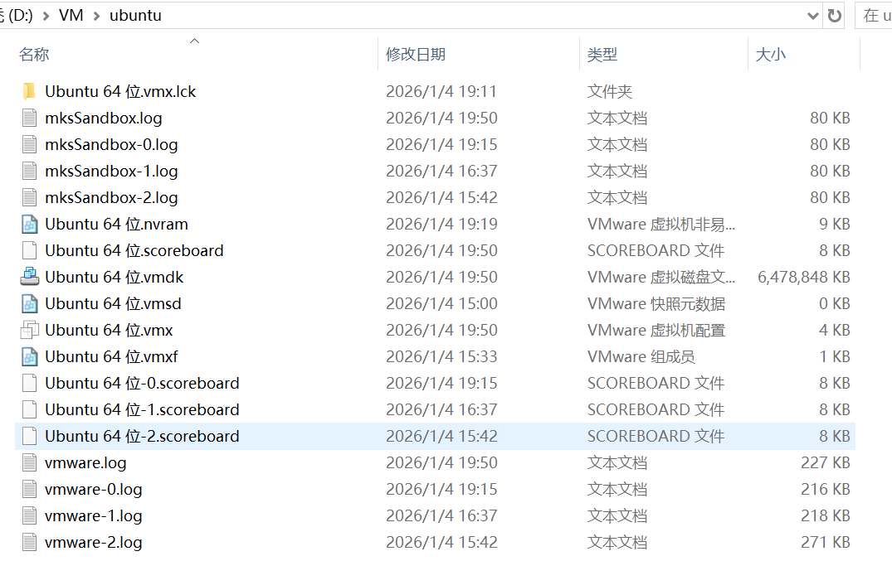

------

# 如何在VM中安装虚拟机linux系统       

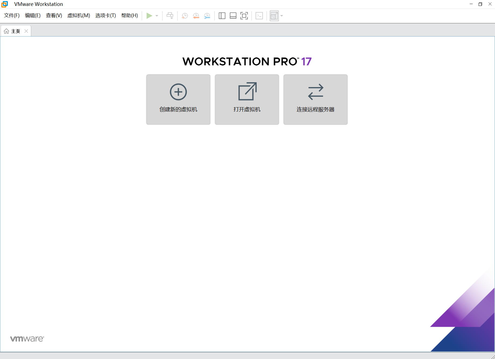       
1.首先安装VM      
2.在宿主机的D盘创建一个文件夹，用于存放虚拟机文件。        
3.在VM中新建虚拟机，选择稍后安装系统。        
4.在ubuntu官网下载ISO文件，并将其放置在刚才创建的文件夹中。        
准备工作如下图所示：        
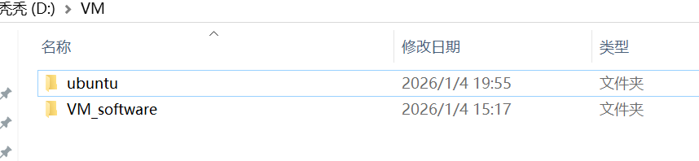        
其中`ubuntu`文件夹是用来存放虚拟机文件的，        
VM_software中的`.iso`是安装系统的镜像文件。        
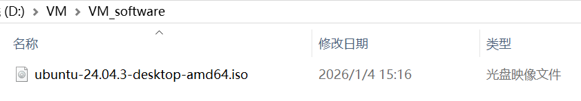         

回到VM中，点击创建虚拟机。该步骤主要是将虚拟机文件创建在刚才的文件夹中。        
也就是在`ubuntu`文件夹中创建虚拟机文件。        
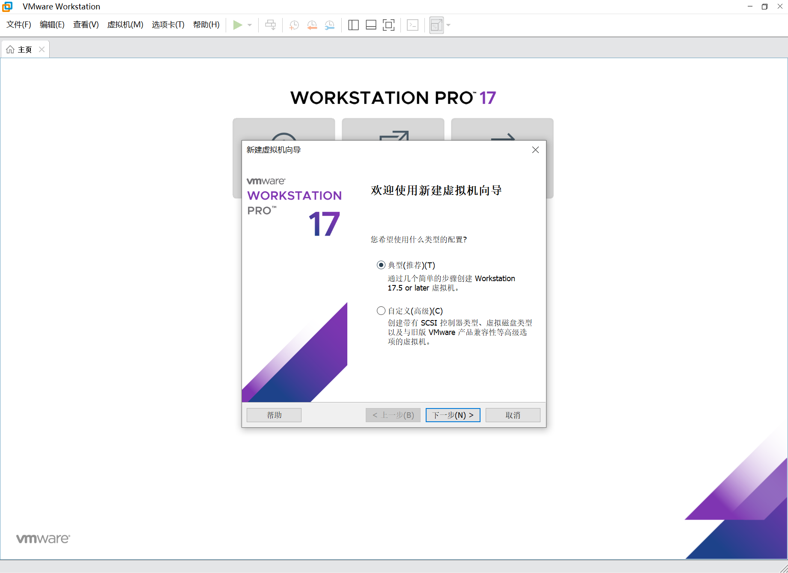        

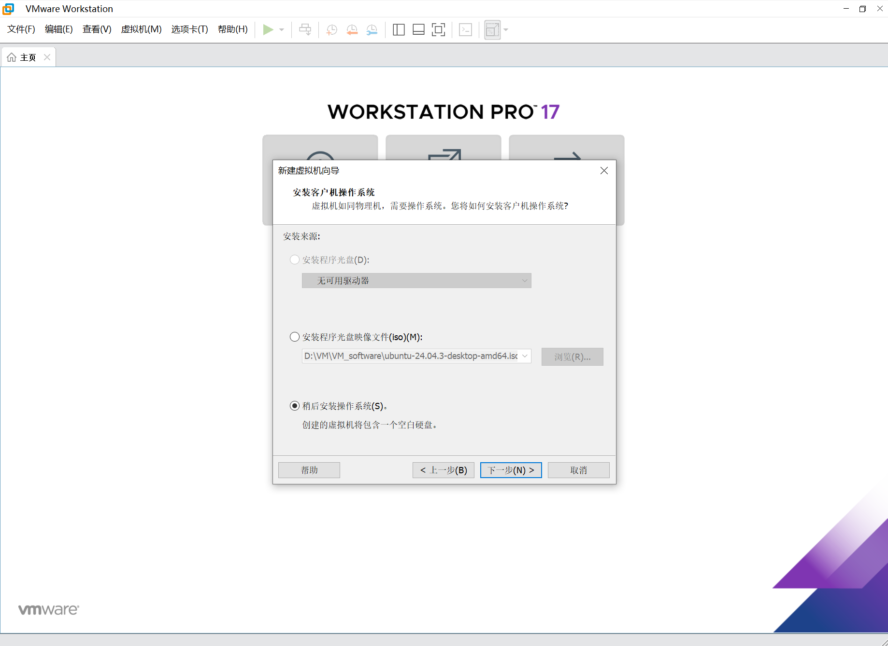         
选择稍后安装，因为我们已经下载好了安装镜像文件。        
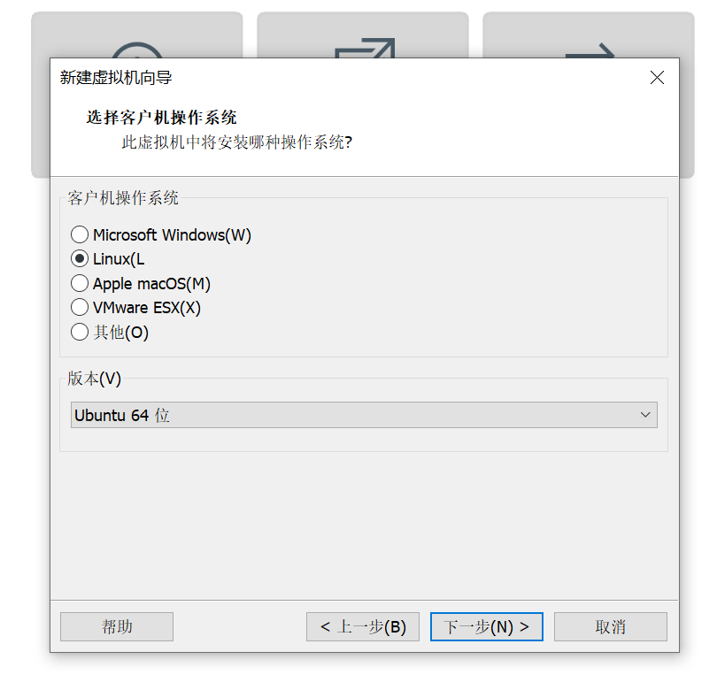       
继续如图选择。         
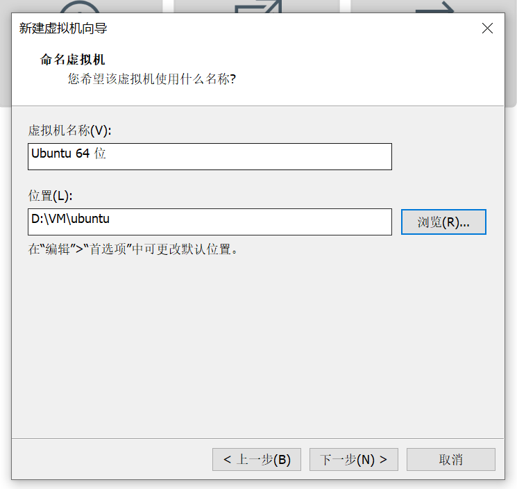        
此处将位置选择到我们刚刚在宿主机上创建的空文件夹。        
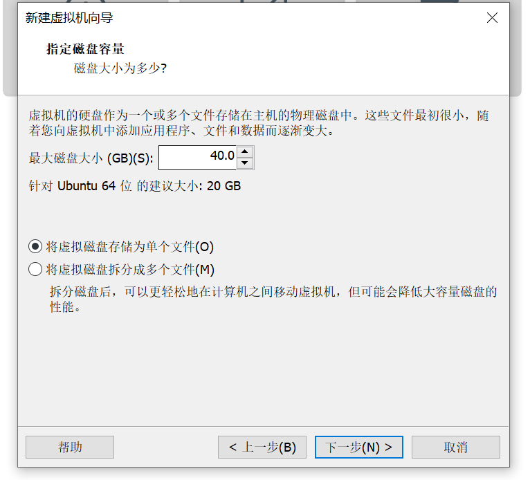         
此处只是先给一个预计的磁盘空间大小，后面可以在VM中调整。        
按照此步骤点击以后，继续进入下一步直到完成。         

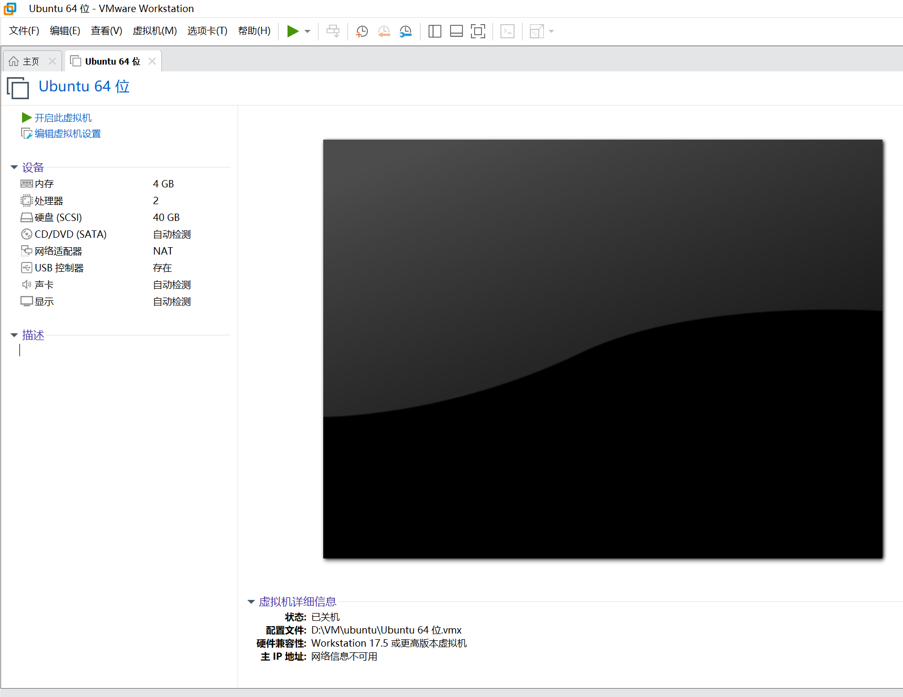         
此时VM如图所示，已经创建好了。        
接下来我们需要进行安装ubuntu。        
在不启动虚拟机的情况下，我们编辑虚拟机设置。       
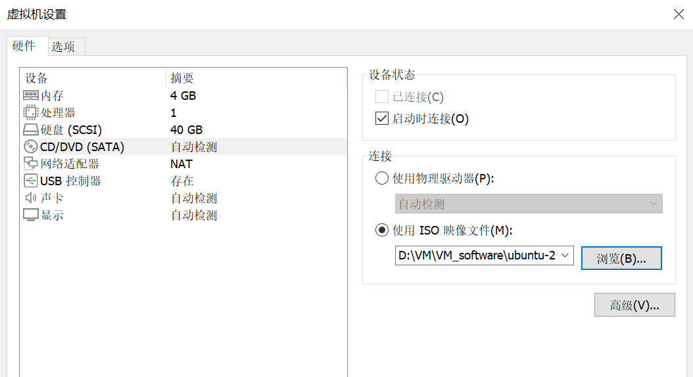        
这里面可以修改内存和处理器数目等。     
主要修改的是CD/DVD，因为我们用的是ISO镜像文件安装系统。        
ISO文件就是从官网下载的安装镜像文件。        
点击确定以后我们启动虚拟机。        
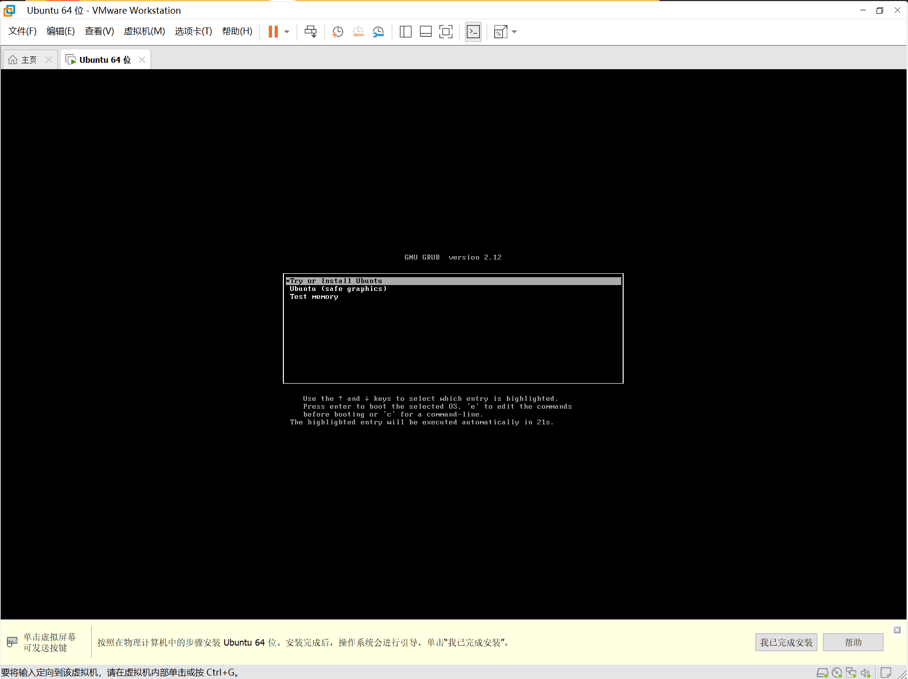        
根据指导完成安装即可。        
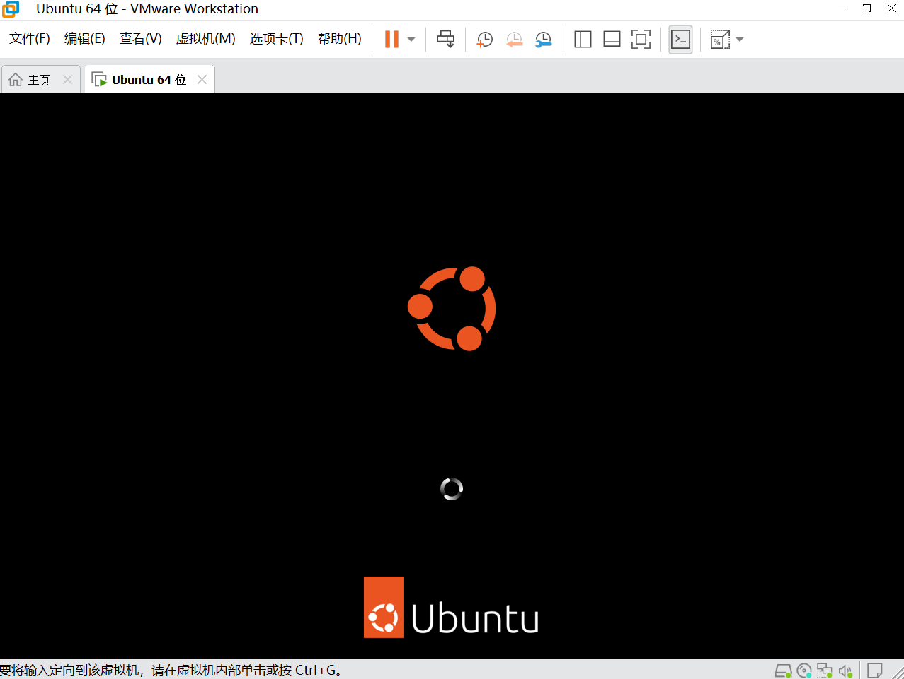         
